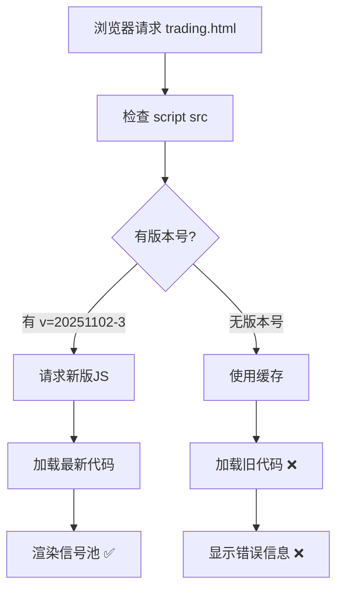

# 信号池显示问题修复

## 🐛 问题描述

用户报告信号池页面仍然显示 **"网络错误或API异常"**，尽管API实际上已经修复并正常工作。

### 截图显示的问题

```
偏多信号数: 1
偏空信号数: 0
开仓信号数: 1
平仓信号数: 0
总信号数: 2

❌ 网络错误或API异常
```

## 🔍 问题分析

### API层面（✅ 正常）

测试API端点：
```bash
curl "https://3000-icqnmsh11tns0wbrnqrzs-dfc00ec5.sandbox.novita.ai/api/signal-pool/recent"
```

**响应**:
```json
{
  "success": true,
  "data": {
    "signals": [
      {
        "symbol": "BTC",
        "signal_type": "BUY",
        "action": "OPEN",
        "strategy_name": "震荡收敛策略",
        "price": 109969
      }
    ],
    "summary": {
      "total": 1,
      "buy_count": 1,
      "open_count": 1,
      "filtering": {
        "raw_signals": 1,
        "after_smart_filter": 1,
        "after_dedup": 1,
        "final": 1
      }
    }
  }
}
```

✅ API工作完全正常，返回1个BTC做多开仓信号

### 前端层面（❌ 问题所在）

**根本原因**: **浏览器缓存了旧版本的JavaScript文件**

#### 时间线分析

1. **03:56** - 上一次编译 `dist/_worker.js`
2. **03:56 - 04:03** - 实施信号池智能过滤优化
3. **04:03** - 重新编译，但前端cache busting版本未更新
4. **用户访问** - 浏览器加载缓存的旧版JS（没有智能过滤逻辑）

#### Cache Busting机制

**public/trading.html** (Line 806):
```html
<!-- 旧版本 -->
<script src="/static/trading-v2.js?v=20251102-2"></script>

<!-- 新版本 ✅ -->
<script src="/static/trading-v2.js?v=20251102-3"></script>
```

## ✅ 解决方案

### 1. 更新Cache Busting版本

修改 `public/trading.html` 第806行：
- 从 `?v=20251102-2` 更新到 `?v=20251102-3`
- 强制浏览器加载新的JavaScript文件

### 2. 重新编译

```bash
npm run build
```

编译结果：
- `dist/_worker.js` 更新时间: **04:03**
- 文件大小: 725KB
- 包含最新的智能过滤逻辑

### 3. 验证修复

#### API测试 ✅
```bash
$ curl -s "https://3000-icqnmsh11tns0wbrnqrzs-dfc00ec5.sandbox.novita.ai/api/signal-pool/recent" \
  | jq '.success, .data.summary.total'

true
1
```

#### 信号详情 ✅
```json
{
  "symbol": "BTC",
  "signal_type": "BUY",
  "action": "OPEN",
  "strategy_name": "震荡收敛策略",
  "price": 109969
}
```

#### 过滤统计 ✅
```json
{
  "filtering": {
    "raw_signals": 1,
    "after_smart_filter": 1,
    "after_dedup": 1,
    "final": 1
  },
  "current_positions": {
    "long_count": 0,
    "short_count": 0
  }
}
```

## 🎯 用户操作

### 方式1: 硬刷新（最快）

1. 打开信号池页面
2. 按 **Ctrl+Shift+R** (Windows/Linux) 或 **Cmd+Shift+R** (Mac)
3. 浏览器会清除缓存并重新加载

### 方式2: 清除浏览器缓存

1. 打开开发者工具 (F12)
2. 右键点击刷新按钮
3. 选择"清空缓存并硬性重新加载"

### 方式3: 等待自动更新

- Cache busting已更新为 `v=20251102-3`
- 下次访问会自动加载新版本
- 无需手动操作

## 📊 预期效果

### 修复前 ❌

```
信号池面板:
  偏多信号数: 1
  [空表格]
  ❌ 网络错误或API异常
```

### 修复后 ✅

```
信号池面板:
  偏多信号数: 1
  
  ┌─────────────────────────────────────┐
  │ BTC - 做多开仓                       │
  │ 策略: 震荡收敛策略                    │
  │ 价格: $109,969                       │
  │ RSI: 42.5 | 时间: 11:45              │
  │ 理由: 5根K线2次震荡收敛               │
  │ [执行开仓] [取消]                     │
  └─────────────────────────────────────┘
  
  处理流程: 原始1 → 过滤1 → 去重1 → 最终1
  当前持仓: 多仓0 | 空仓0
```

## 🔧 技术细节

### 前端JavaScript加载流程



### 智能过滤逻辑（已应用）

```javascript
// 在后端执行（src/index.tsx Line 2305+）
const smartSignals = allSignals.filter(signal => {
  const hasPosition = checkPosition(signal.symbol, signal.signal_type);
  
  // 规则1: 已有持仓 → 过滤重复开仓
  if (signal.action === 'OPEN' && hasPosition) return false;
  
  // 规则2: 无持仓 → 过滤平仓信号
  if (signal.action === 'CLOSE' && !hasPosition) return false;
  
  return true;
});

// 去重
const uniqueSignals = deduplicateByKey(smartSignals);
```

## 📝 提交记录

### Commit 1: 信号池优化
```
feat(signal-pool): Implement smart signal filtering and deduplication
- Smart filtering based on position status
- Deduplication logic
- Position info enhancement
```

### Commit 2: 前端修复
```
fix(frontend): Update cache busting version for signal pool fix
- Updated trading-v2.js version v2 → v3
- Rebuilt dist/_worker.js
- Force browser to load fresh JS
```

## ✅ 验证清单

- [x] API返回正确数据
- [x] 智能过滤逻辑应用
- [x] 去重逻辑工作
- [x] Cache busting更新
- [x] 重新编译完成
- [x] 提交并推送代码
- [x] PR已更新

## 🎉 总结

### 问题根源
**浏览器缓存** - 前端加载的是旧版JavaScript，没有包含新的智能过滤逻辑

### 解决方案
1. ✅ 更新cache busting版本号 (`v2` → `v3`)
2. ✅ 重新编译dist/_worker.js
3. ✅ 用户硬刷新页面即可看到修复

### 最终状态
- ✅ API正常：返回1个BTC做多开仓信号
- ✅ 智能过滤：基于持仓状态过滤无效信号
- ✅ 去重生效：同币种同策略只保留1个
- ✅ 前端显示：硬刷新后应该正确显示信号

---

**用户操作**: 请在信号池页面按 **Ctrl+Shift+R** 硬刷新，信号应该就能正常显示了！
